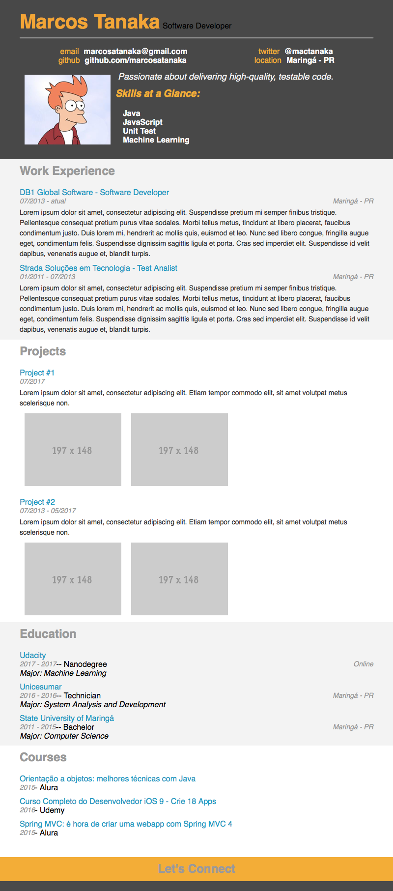

# Project Details
### What it is
This is a resume created to study Udacity's JavaScript Basics online course. The idea is to use JavaScript (with jQuery) to build the resume's sections.

### Result

### More info
[JavaScript Basics course](https://udacity.com/course/javascript-basics--ud804)